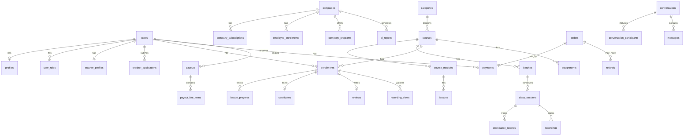

# Nama Wellness — PostgreSQL Database Design

**Version:** 1.0  
**Source:** [Product Requirements Document](./prd.md) · [System Architecture](./architecture.md)  
**Database:** PostgreSQL 15+

---

## 1. Design Conventions

| Convention | Choice |
|------------|--------|
| Primary keys | `UUID` via `gen_random_uuid()` |
| Timestamps | `TIMESTAMPTZ`, default `NOW()` |
| Money | `NUMERIC(12, 2)` |
| Percentages / rates | `NUMERIC(5, 2)` |
| Soft delete | `deleted_at TIMESTAMPTZ NULL` on user-facing entities |
| Naming | `snake_case`; junction tables `{entity_a}_{entity_b}` |
| Enums | PostgreSQL `ENUM` types for fixed domain values |
| JSON metadata | `JSONB` for flexible audit/extension fields |
| Text search | `GIN` index on `tsvector` where noted |

All tables include `created_at` and `updated_at` unless stated otherwise. `updated_at` is maintained by application layer or trigger.

---

## 2. Enum Types

```sql
CREATE TYPE product_variant      AS ENUM ('edpro', 'corporate');
CREATE TYPE user_role            AS ENUM ('student', 'teacher', 'admin', 'employee', 'company_admin');
CREATE TYPE user_status          AS ENUM ('active', 'suspended', 'terminated');
CREATE TYPE otp_purpose          AS ENUM ('email_verify', 'phone_verify', 'password_reset');

CREATE TYPE teacher_app_status   AS ENUM ('draft', 'pending', 'under_review', 'interview_scheduled', 'approved', 'rejected');
CREATE TYPE document_type        AS ENUM ('government_id', 'certification', 'experience_proof', 'profile_photo');
CREATE TYPE interview_outcome    AS ENUM ('pending', 'passed', 'failed');
CREATE TYPE performance_status   AS ENUM ('good_standing', 'warning', 'probation', 'suspension', 'terminated');

CREATE TYPE company_status       AS ENUM ('active', 'suspended', 'inactive');
CREATE TYPE subscription_tier    AS ENUM ('up_to_10', 'up_to_25', 'up_to_50', 'up_to_100', 'custom');
CREATE TYPE subscription_status  AS ENUM ('active', 'past_due', 'cancelled', 'trialing');

CREATE TYPE course_type          AS ENUM ('live', 'recorded', 'hybrid', 'individual');
CREATE TYPE course_status        AS ENUM ('draft', 'pending_review', 'changes_requested', 'approved', 'published', 'rejected', 'archived');
CREATE TYPE lesson_type          AS ENUM ('video', 'document', 'live');
CREATE TYPE approval_status      AS ENUM ('pending', 'approved', 'rejected');

CREATE TYPE batch_status         AS ENUM ('upcoming', 'active', 'completed', 'cancelled');
CREATE TYPE session_status       AS ENUM ('scheduled', 'in_progress', 'completed', 'cancelled');
CREATE TYPE booking_status       AS ENUM ('pending', 'confirmed', 'completed', 'cancelled', 'no_show');

CREATE TYPE enrollment_source    AS ENUM ('purchase', 'corporate', 'admin_assigned', 'reassignment');
CREATE TYPE enrollment_status    AS ENUM ('active', 'completed', 'refunded', 'cancelled');

CREATE TYPE recording_type       AS ENUM ('auto', 'replacement');
CREATE TYPE recording_status     AS ENUM ('processing', 'pending_review', 'approved', 'rejected');

CREATE TYPE submission_status    AS ENUM ('submitted', 'under_review', 'approved', 'rejected', 'resubmitted');
CREATE TYPE certificate_status   AS ENUM ('pending_approval', 'issued', 'revoked');

CREATE TYPE review_status        AS ENUM ('active', 'flagged', 'removed');
CREATE TYPE complaint_status     AS ENUM ('open', 'investigating', 'resolved', 'dismissed');

CREATE TYPE payment_gateway      AS ENUM ('razorpay', 'stripe', 'upi');
CREATE TYPE payment_purpose      AS ENUM ('course_purchase', 'teacher_onboarding', 'corporate_subscription');
CREATE TYPE payment_status       AS ENUM ('pending', 'processing', 'completed', 'failed', 'refunded');
CREATE TYPE order_status         AS ENUM ('pending', 'paid', 'failed', 'refunded', 'cancelled');
CREATE TYPE refund_status        AS ENUM ('requested', 'approved', 'rejected', 'processed');
CREATE TYPE payout_status        AS ENUM ('pending', 'held', 'approved', 'paid', 'cancelled');

CREATE TYPE employee_status      AS ENUM ('invited', 'active', 'deactivated');
CREATE TYPE invite_status        AS ENUM ('pending', 'accepted', 'expired', 'revoked');
CREATE TYPE conversation_type     AS ENUM ('direct', 'course_thread');
CREATE TYPE message_type         AS ENUM ('text', 'file', 'system');
CREATE TYPE termination_resolution AS ENUM ('refund', 'reassignment', 'alternative', 'none');
CREATE TYPE ai_report_type       AS ENUM ('monthly_wellness', 'engagement_summary', 'program_recommendation');
```

---

## 3. Tables

### 3.1 Identity & Access

#### `users`

| Column | Type | Constraints | Description |
|--------|------|-------------|-------------|
| id | UUID | PK, DEFAULT gen_random_uuid() | |
| email | VARCHAR(255) | NOT NULL | Login identifier |
| phone | VARCHAR(20) | NULL | E.164 format |
| password_hash | VARCHAR(255) | NOT NULL | bcrypt/argon2 hash |
| email_verified | BOOLEAN | NOT NULL DEFAULT FALSE | |
| phone_verified | BOOLEAN | NOT NULL DEFAULT FALSE | |
| status | user_status | NOT NULL DEFAULT 'active' | |
| last_login_at | TIMESTAMPTZ | NULL | |
| deleted_at | TIMESTAMPTZ | NULL | Soft delete |
| created_at | TIMESTAMPTZ | NOT NULL DEFAULT NOW() | |
| updated_at | TIMESTAMPTZ | NOT NULL DEFAULT NOW() | |

#### `profiles`

| Column | Type | Constraints | Description |
|--------|------|-------------|-------------|
| id | UUID | PK | |
| user_id | UUID | NOT NULL, UNIQUE, FK → users | 1:1 with users |
| first_name | VARCHAR(100) | NOT NULL | |
| last_name | VARCHAR(100) | NOT NULL | |
| avatar_url | TEXT | NULL | S3 URL |
| bio | TEXT | NULL | |
| timezone | VARCHAR(50) | NOT NULL DEFAULT 'Asia/Kolkata' | IANA timezone |
| created_at | TIMESTAMPTZ | NOT NULL DEFAULT NOW() | |
| updated_at | TIMESTAMPTZ | NOT NULL DEFAULT NOW() | |

#### `user_roles`

| Column | Type | Constraints | Description |
|--------|------|-------------|-------------|
| id | UUID | PK | |
| user_id | UUID | NOT NULL, FK → users | |
| role | user_role | NOT NULL | |
| product_variant | product_variant | NOT NULL | edpro or corporate |
| company_id | UUID | NULL, FK → companies | Required for employee/company_admin |
| granted_at | TIMESTAMPTZ | NOT NULL DEFAULT NOW() | |
| revoked_at | TIMESTAMPTZ | NULL | |
| created_at | TIMESTAMPTZ | NOT NULL DEFAULT NOW() | |

**Unique:** `(user_id, role, product_variant, company_id)` where `revoked_at IS NULL`

#### `refresh_tokens`

| Column | Type | Constraints | Description |
|--------|------|-------------|-------------|
| id | UUID | PK | |
| user_id | UUID | NOT NULL, FK → users | |
| token_hash | VARCHAR(255) | NOT NULL, UNIQUE | Hashed refresh token |
| expires_at | TIMESTAMPTZ | NOT NULL | |
| revoked_at | TIMESTAMPTZ | NULL | |
| user_agent | TEXT | NULL | |
| ip_address | INET | NULL | |
| created_at | TIMESTAMPTZ | NOT NULL DEFAULT NOW() | |

#### `otp_verifications`

| Column | Type | Constraints | Description |
|--------|------|-------------|-------------|
| id | UUID | PK | |
| identifier | VARCHAR(255) | NOT NULL | Email or phone |
| code_hash | VARCHAR(255) | NOT NULL | |
| purpose | otp_purpose | NOT NULL | |
| expires_at | TIMESTAMPTZ | NOT NULL | |
| consumed_at | TIMESTAMPTZ | NULL | |
| attempt_count | SMALLINT | NOT NULL DEFAULT 0 | Rate-limit tracking |
| created_at | TIMESTAMPTZ | NOT NULL DEFAULT NOW() | |

---

### 3.2 Teacher Lifecycle

#### `teacher_applications`

| Column | Type | Constraints | Description |
|--------|------|-------------|-------------|
| id | UUID | PK | |
| user_id | UUID | NOT NULL, FK → users | Applicant |
| status | teacher_app_status | NOT NULL DEFAULT 'draft' | |
| submitted_at | TIMESTAMPTZ | NULL | |
| reviewed_by | UUID | NULL, FK → users | Admin |
| reviewed_at | TIMESTAMPTZ | NULL | |
| rejection_reason | TEXT | NULL | |
| admin_notes | TEXT | NULL | |
| created_at | TIMESTAMPTZ | NOT NULL DEFAULT NOW() | |
| updated_at | TIMESTAMPTZ | NOT NULL DEFAULT NOW() | |

#### `teacher_documents`

| Column | Type | Constraints | Description |
|--------|------|-------------|-------------|
| id | UUID | PK | |
| application_id | UUID | NOT NULL, FK → teacher_applications | |
| document_type | document_type | NOT NULL | |
| file_url | TEXT | NOT NULL | S3 URL |
| file_name | VARCHAR(255) | NOT NULL | |
| mime_type | VARCHAR(100) | NOT NULL | |
| file_size_bytes | BIGINT | NOT NULL | |
| verified | BOOLEAN | NOT NULL DEFAULT FALSE | |
| verified_by | UUID | NULL, FK → users | |
| verified_at | TIMESTAMPTZ | NULL | |
| created_at | TIMESTAMPTZ | NOT NULL DEFAULT NOW() | |
| updated_at | TIMESTAMPTZ | NOT NULL DEFAULT NOW() | |

#### `teacher_interviews`

| Column | Type | Constraints | Description |
|--------|------|-------------|-------------|
| id | UUID | PK | |
| application_id | UUID | NOT NULL, FK → teacher_applications | |
| scheduled_at | TIMESTAMPTZ | NOT NULL | |
| conducted_by | UUID | NULL, FK → users | Admin |
| outcome | interview_outcome | NOT NULL DEFAULT 'pending' | |
| notes | TEXT | NULL | |
| created_at | TIMESTAMPTZ | NOT NULL DEFAULT NOW() | |
| updated_at | TIMESTAMPTZ | NOT NULL DEFAULT NOW() | |

#### `teacher_profiles`

| Column | Type | Constraints | Description |
|--------|------|-------------|-------------|
| id | UUID | PK | |
| user_id | UUID | NOT NULL, UNIQUE, FK → users | |
| onboarding_fee_paid | BOOLEAN | NOT NULL DEFAULT FALSE | |
| onboarding_paid_at | TIMESTAMPTZ | NULL | |
| onboarding_payment_id | UUID | NULL, FK → payments | |
| performance_status | performance_status | NOT NULL DEFAULT 'good_standing' | |
| specialties | TEXT[] | NULL | Category tags |
| average_rating | NUMERIC(3,2) | NULL | Denormalized |
| total_reviews | INTEGER | NOT NULL DEFAULT 0 | Denormalized |
| activated_at | TIMESTAMPTZ | NULL | Post fee payment |
| created_at | TIMESTAMPTZ | NOT NULL DEFAULT NOW() | |
| updated_at | TIMESTAMPTZ | NOT NULL DEFAULT NOW() | |

#### `teacher_complaints`

| Column | Type | Constraints | Description |
|--------|------|-------------|-------------|
| id | UUID | PK | |
| teacher_id | UUID | NOT NULL, FK → users | |
| reported_by | UUID | NOT NULL, FK → users | Student or admin |
| course_id | UUID | NULL, FK → courses | |
| description | TEXT | NOT NULL | |
| status | complaint_status | NOT NULL DEFAULT 'open' | |
| resolution | TEXT | NULL | |
| resolved_by | UUID | NULL, FK → users | |
| resolved_at | TIMESTAMPTZ | NULL | |
| created_at | TIMESTAMPTZ | NOT NULL DEFAULT NOW() | |
| updated_at | TIMESTAMPTZ | NOT NULL DEFAULT NOW() | |

#### `teacher_termination_cases`

| Column | Type | Constraints | Description |
|--------|------|-------------|-------------|
| id | UUID | PK | |
| teacher_id | UUID | NOT NULL, FK → users | |
| initiated_by | UUID | NOT NULL, FK → users | Admin |
| reason | TEXT | NOT NULL | |
| resolution_type | termination_resolution | NULL | Per active student |
| status | complaint_status | NOT NULL DEFAULT 'open' | Reuses investigation flow |
| completed_at | TIMESTAMPTZ | NULL | |
| created_at | TIMESTAMPTZ | NOT NULL DEFAULT NOW() | |
| updated_at | TIMESTAMPTZ | NOT NULL DEFAULT NOW() | |

---

### 3.3 Corporate / Organization

#### `companies`

| Column | Type | Constraints | Description |
|--------|------|-------------|-------------|
| id | UUID | PK | |
| name | VARCHAR(255) | NOT NULL | |
| company_code | VARCHAR(20) | NOT NULL, UNIQUE | Employee registration code |
| status | company_status | NOT NULL DEFAULT 'active' | |
| employee_limit | INTEGER | NOT NULL | Seat cap from subscription |
| contact_email | VARCHAR(255) | NOT NULL | |
| contact_phone | VARCHAR(20) | NULL | |
| deleted_at | TIMESTAMPTZ | NULL | |
| created_at | TIMESTAMPTZ | NOT NULL DEFAULT NOW() | |
| updated_at | TIMESTAMPTZ | NOT NULL DEFAULT NOW() | |

#### `company_subscriptions`

| Column | Type | Constraints | Description |
|--------|------|-------------|-------------|
| id | UUID | PK | |
| company_id | UUID | NOT NULL, FK → companies | |
| tier | subscription_tier | NOT NULL | |
| monthly_fee | NUMERIC(12,2) | NOT NULL | INR |
| seat_count | INTEGER | NOT NULL | |
| status | subscription_status | NOT NULL DEFAULT 'active' | |
| billing_cycle_start | DATE | NOT NULL | |
| billing_cycle_end | DATE | NULL | |
| payment_id | UUID | NULL, FK → payments | Latest renewal |
| created_at | TIMESTAMPTZ | NOT NULL DEFAULT NOW() | |
| updated_at | TIMESTAMPTZ | NOT NULL DEFAULT NOW() | |

#### `company_admins`

| Column | Type | Constraints | Description |
|--------|------|-------------|-------------|
| id | UUID | PK | |
| company_id | UUID | NOT NULL, FK → companies | |
| user_id | UUID | NOT NULL, FK → users | |
| is_primary | BOOLEAN | NOT NULL DEFAULT FALSE | |
| created_at | TIMESTAMPTZ | NOT NULL DEFAULT NOW() | |

**Unique:** `(company_id, user_id)`

#### `employee_enrollments`

| Column | Type | Constraints | Description |
|--------|------|-------------|-------------|
| id | UUID | PK | |
| company_id | UUID | NOT NULL, FK → companies | |
| user_id | UUID | NOT NULL, FK → users | |
| status | employee_status | NOT NULL DEFAULT 'active' | |
| enrolled_at | TIMESTAMPTZ | NOT NULL DEFAULT NOW() | |
| deactivated_at | TIMESTAMPTZ | NULL | |
| created_at | TIMESTAMPTZ | NOT NULL DEFAULT NOW() | |
| updated_at | TIMESTAMPTZ | NOT NULL DEFAULT NOW() | |

**Unique:** `(company_id, user_id)`

#### `employee_invites`

| Column | Type | Constraints | Description |
|--------|------|-------------|-------------|
| id | UUID | PK | |
| company_id | UUID | NOT NULL, FK → companies | |
| email | VARCHAR(255) | NOT NULL | |
| invited_by | UUID | NOT NULL, FK → users | Company admin |
| token_hash | VARCHAR(255) | NOT NULL, UNIQUE | |
| status | invite_status | NOT NULL DEFAULT 'pending' | |
| expires_at | TIMESTAMPTZ | NOT NULL | |
| accepted_at | TIMESTAMPTZ | NULL | |
| created_at | TIMESTAMPTZ | NOT NULL DEFAULT NOW() | |

#### `company_programs`

| Column | Type | Constraints | Description |
|--------|------|-------------|-------------|
| id | UUID | PK | |
| company_id | UUID | NOT NULL, FK → companies | |
| course_id | UUID | NOT NULL, FK → courses | Wellness program course |
| is_active | BOOLEAN | NOT NULL DEFAULT TRUE | |
| assigned_by | UUID | NULL, FK → users | Admin |
| created_at | TIMESTAMPTZ | NOT NULL DEFAULT NOW() | |
| updated_at | TIMESTAMPTZ | NOT NULL DEFAULT NOW() | |

**Unique:** `(company_id, course_id)`

#### `ai_reports`

| Column | Type | Constraints | Description |
|--------|------|-------------|-------------|
| id | UUID | PK | |
| company_id | UUID | NOT NULL, FK → companies | |
| report_type | ai_report_type | NOT NULL | |
| period_start | DATE | NOT NULL | |
| period_end | DATE | NOT NULL | |
| wellness_score | NUMERIC(5,2) | NULL | |
| content | JSONB | NOT NULL | AI-generated insights |
| generated_at | TIMESTAMPTZ | NOT NULL DEFAULT NOW() | |
| created_at | TIMESTAMPTZ | NOT NULL DEFAULT NOW() | |

---

### 3.4 Catalog & Courses

#### `categories`

| Column | Type | Constraints | Description |
|--------|------|-------------|-------------|
| id | UUID | PK | |
| name | VARCHAR(100) | NOT NULL | |
| slug | VARCHAR(100) | NOT NULL, UNIQUE | URL-safe |
| description | TEXT | NULL | |
| icon_url | TEXT | NULL | |
| is_active | BOOLEAN | NOT NULL DEFAULT TRUE | |
| sort_order | INTEGER | NOT NULL DEFAULT 0 | |
| created_at | TIMESTAMPTZ | NOT NULL DEFAULT NOW() | |
| updated_at | TIMESTAMPTZ | NOT NULL DEFAULT NOW() | |

#### `courses`

| Column | Type | Constraints | Description |
|--------|------|-------------|-------------|
| id | UUID | PK | |
| title | VARCHAR(255) | NOT NULL | |
| slug | VARCHAR(255) | NOT NULL, UNIQUE | |
| description | TEXT | NOT NULL | |
| course_type | course_type | NOT NULL | live, recorded, hybrid, individual |
| category_id | UUID | NOT NULL, FK → categories | |
| teacher_id | UUID | NULL, FK → users | NULL if admin-created |
| assigned_by | UUID | NULL, FK → users | Admin assignment |
| status | course_status | NOT NULL DEFAULT 'draft' | |
| cover_image_url | TEXT | NULL | |
| published_at | TIMESTAMPTZ | NULL | |
| rejected_reason | TEXT | NULL | |
| created_at | TIMESTAMPTZ | NOT NULL DEFAULT NOW() | |
| updated_at | TIMESTAMPTZ | NOT NULL DEFAULT NOW() | |

#### `course_pricing`

| Column | Type | Constraints | Description |
|--------|------|-------------|-------------|
| id | UUID | PK | |
| course_id | UUID | NOT NULL, FK → courses | |
| amount | NUMERIC(12,2) | NOT NULL | |
| currency | CHAR(3) | NOT NULL DEFAULT 'INR' | |
| proposed_by | UUID | NOT NULL, FK → users | |
| approved_by | UUID | NULL, FK → users | |
| approval_status | approval_status | NOT NULL DEFAULT 'pending' | |
| effective_at | TIMESTAMPTZ | NULL | When approved |
| is_current | BOOLEAN | NOT NULL DEFAULT TRUE | Active price |
| created_at | TIMESTAMPTZ | NOT NULL DEFAULT NOW() | |
| updated_at | TIMESTAMPTZ | NOT NULL DEFAULT NOW() | |

#### `course_modules`

| Column | Type | Constraints | Description |
|--------|------|-------------|-------------|
| id | UUID | PK | |
| course_id | UUID | NOT NULL, FK → courses | |
| title | VARCHAR(255) | NOT NULL | |
| description | TEXT | NULL | |
| sort_order | INTEGER | NOT NULL DEFAULT 0 | |
| created_at | TIMESTAMPTZ | NOT NULL DEFAULT NOW() | |
| updated_at | TIMESTAMPTZ | NOT NULL DEFAULT NOW() | |

#### `lessons`

| Column | Type | Constraints | Description |
|--------|------|-------------|-------------|
| id | UUID | PK | |
| module_id | UUID | NOT NULL, FK → course_modules | |
| title | VARCHAR(255) | NOT NULL | |
| lesson_type | lesson_type | NOT NULL | |
| content_url | TEXT | NULL | S3 URL for video/document |
| duration_seconds | INTEGER | NULL | |
| sort_order | INTEGER | NOT NULL DEFAULT 0 | |
| is_preview | BOOLEAN | NOT NULL DEFAULT FALSE | Free preview |
| created_at | TIMESTAMPTZ | NOT NULL DEFAULT NOW() | |
| updated_at | TIMESTAMPTZ | NOT NULL DEFAULT NOW() | |

#### `study_materials`

| Column | Type | Constraints | Description |
|--------|------|-------------|-------------|
| id | UUID | PK | |
| course_id | UUID | NOT NULL, FK → courses | |
| title | VARCHAR(255) | NOT NULL | |
| file_url | TEXT | NOT NULL | |
| file_name | VARCHAR(255) | NOT NULL | |
| mime_type | VARCHAR(100) | NOT NULL | |
| file_size_bytes | BIGINT | NOT NULL | |
| uploaded_by | UUID | NOT NULL, FK → users | |
| approval_status | approval_status | NOT NULL DEFAULT 'pending' | |
| approved_by | UUID | NULL, FK → users | |
| approved_at | TIMESTAMPTZ | NULL | |
| created_at | TIMESTAMPTZ | NOT NULL DEFAULT NOW() | |
| updated_at | TIMESTAMPTZ | NOT NULL DEFAULT NOW() | |

---

### 3.5 Scheduling & Live Classes

#### `batches`

| Column | Type | Constraints | Description |
|--------|------|-------------|-------------|
| id | UUID | PK | |
| course_id | UUID | NOT NULL, FK → courses | |
| name | VARCHAR(255) | NOT NULL | |
| capacity | INTEGER | NOT NULL | |
| enrolled_count | INTEGER | NOT NULL DEFAULT 0 | Denormalized |
| start_date | DATE | NOT NULL | |
| end_date | DATE | NULL | |
| status | batch_status | NOT NULL DEFAULT 'upcoming' | |
| created_at | TIMESTAMPTZ | NOT NULL DEFAULT NOW() | |
| updated_at | TIMESTAMPTZ | NOT NULL DEFAULT NOW() | |

#### `class_sessions`

| Column | Type | Constraints | Description |
|--------|------|-------------|-------------|
| id | UUID | PK | |
| batch_id | UUID | NOT NULL, FK → batches | |
| title | VARCHAR(255) | NOT NULL | |
| scheduled_at | TIMESTAMPTZ | NOT NULL | |
| duration_minutes | INTEGER | NOT NULL | |
| meet_link | TEXT | NULL | Google Meet URL |
| calendar_event_id | VARCHAR(255) | NULL | Google Calendar event ID |
| status | session_status | NOT NULL DEFAULT 'scheduled' | |
| started_at | TIMESTAMPTZ | NULL | Actual start |
| ended_at | TIMESTAMPTZ | NULL | Actual end |
| created_at | TIMESTAMPTZ | NOT NULL DEFAULT NOW() | |
| updated_at | TIMESTAMPTZ | NOT NULL DEFAULT NOW() | |

#### `teacher_availability`

| Column | Type | Constraints | Description |
|--------|------|-------------|-------------|
| id | UUID | PK | |
| teacher_id | UUID | NOT NULL, FK → users | |
| day_of_week | SMALLINT | NOT NULL | 0=Sunday … 6=Saturday |
| start_time | TIME | NOT NULL | |
| end_time | TIME | NOT NULL | |
| is_recurring | BOOLEAN | NOT NULL DEFAULT TRUE | |
| valid_from | DATE | NULL | |
| valid_until | DATE | NULL | |
| created_at | TIMESTAMPTZ | NOT NULL DEFAULT NOW() | |
| updated_at | TIMESTAMPTZ | NOT NULL DEFAULT NOW() | |

**Check:** `start_time < end_time`

#### `individual_bookings`

| Column | Type | Constraints | Description |
|--------|------|-------------|-------------|
| id | UUID | PK | |
| course_id | UUID | NOT NULL, FK → courses | |
| student_id | UUID | NOT NULL, FK → users | |
| teacher_id | UUID | NOT NULL, FK → users | |
| slot_start | TIMESTAMPTZ | NOT NULL | |
| slot_end | TIMESTAMPTZ | NOT NULL | |
| meet_link | TEXT | NULL | |
| calendar_event_id | VARCHAR(255) | NULL | |
| status | booking_status | NOT NULL DEFAULT 'pending' | |
| order_id | UUID | NULL, FK → orders | Payment link |
| created_at | TIMESTAMPTZ | NOT NULL DEFAULT NOW() | |
| updated_at | TIMESTAMPTZ | NOT NULL DEFAULT NOW() | |

**Check:** `slot_start < slot_end`

#### `attendance_records`

| Column | Type | Constraints | Description |
|--------|------|-------------|-------------|
| id | UUID | PK | |
| session_id | UUID | NOT NULL, FK → class_sessions | |
| user_id | UUID | NOT NULL, FK → users | Student or employee |
| joined_at | TIMESTAMPTZ | NOT NULL | |
| left_at | TIMESTAMPTZ | NULL | |
| duration_seconds | INTEGER | NULL | Computed on leave |
| attendance_percentage | NUMERIC(5,2) | NULL | vs session duration |
| created_at | TIMESTAMPTZ | NOT NULL DEFAULT NOW() | |
| updated_at | TIMESTAMPTZ | NOT NULL DEFAULT NOW() | |

**Unique:** `(session_id, user_id)`

---

### 3.6 Enrollment & Progress

#### `enrollments`

| Column | Type | Constraints | Description |
|--------|------|-------------|-------------|
| id | UUID | PK | |
| user_id | UUID | NOT NULL, FK → users | |
| course_id | UUID | NOT NULL, FK → courses | |
| batch_id | UUID | NULL, FK → batches | Required for live/hybrid |
| company_id | UUID | NULL, FK → companies | Corporate enrollments |
| source | enrollment_source | NOT NULL | |
| status | enrollment_status | NOT NULL DEFAULT 'active' | |
| order_id | UUID | NULL, FK → orders | Purchase reference |
| enrolled_at | TIMESTAMPTZ | NOT NULL DEFAULT NOW() | |
| completed_at | TIMESTAMPTZ | NULL | |
| progress_percent | NUMERIC(5,2) | NOT NULL DEFAULT 0 | Denormalized |
| created_at | TIMESTAMPTZ | NOT NULL DEFAULT NOW() | |
| updated_at | TIMESTAMPTZ | NOT NULL DEFAULT NOW() | |

**Unique:** `(user_id, course_id)` where `status NOT IN ('refunded','cancelled')`

#### `lesson_progress`

| Column | Type | Constraints | Description |
|--------|------|-------------|-------------|
| id | UUID | PK | |
| enrollment_id | UUID | NOT NULL, FK → enrollments | |
| lesson_id | UUID | NOT NULL, FK → lessons | |
| progress_percent | NUMERIC(5,2) | NOT NULL DEFAULT 0 | |
| completed_at | TIMESTAMPTZ | NULL | |
| last_position_seconds | INTEGER | NULL | Video resume point |
| created_at | TIMESTAMPTZ | NOT NULL DEFAULT NOW() | |
| updated_at | TIMESTAMPTZ | NOT NULL DEFAULT NOW() | |

**Unique:** `(enrollment_id, lesson_id)`

#### `recording_views`

| Column | Type | Constraints | Description |
|--------|------|-------------|-------------|
| id | UUID | PK | |
| enrollment_id | UUID | NOT NULL, FK → enrollments | |
| recording_id | UUID | NOT NULL, FK → recordings | |
| view_count | INTEGER | NOT NULL DEFAULT 0 | Max 5 unless overridden |
| last_viewed_at | TIMESTAMPTZ | NULL | |
| created_at | TIMESTAMPTZ | NOT NULL DEFAULT NOW() | |
| updated_at | TIMESTAMPTZ | NOT NULL DEFAULT NOW() | |

**Unique:** `(enrollment_id, recording_id)`

#### `recording_access_overrides`

| Column | Type | Constraints | Description |
|--------|------|-------------|-------------|
| id | UUID | PK | |
| enrollment_id | UUID | NOT NULL, FK → enrollments | |
| recording_id | UUID | NOT NULL, FK → recordings | |
| max_replay_count | INTEGER | NULL | NULL = unlimited |
| granted_by | UUID | NOT NULL, FK → users | Admin |
| reason | TEXT | NULL | |
| created_at | TIMESTAMPTZ | NOT NULL DEFAULT NOW() | |

**Unique:** `(enrollment_id, recording_id)`

---

### 3.7 Recordings

#### `recordings`

| Column | Type | Constraints | Description |
|--------|------|-------------|-------------|
| id | UUID | PK | |
| session_id | UUID | NOT NULL, FK → class_sessions | |
| course_id | UUID | NOT NULL, FK → courses | Denormalized for queries |
| recording_type | recording_type | NOT NULL DEFAULT 'auto' | |
| file_url | TEXT | NULL | S3 URL after processing |
| duration_seconds | INTEGER | NULL | |
| status | recording_status | NOT NULL DEFAULT 'processing' | |
| max_replay_count | INTEGER | NOT NULL DEFAULT 5 | Platform default |
| reviewed_by | UUID | NULL, FK → users | Admin for replacement |
| reviewed_at | TIMESTAMPTZ | NULL | |
| created_at | TIMESTAMPTZ | NOT NULL DEFAULT NOW() | |
| updated_at | TIMESTAMPTZ | NOT NULL DEFAULT NOW() | |

#### `replacement_recordings`

| Column | Type | Constraints | Description |
|--------|------|-------------|-------------|
| id | UUID | PK | |
| original_session_id | UUID | NOT NULL, FK → class_sessions | Missed live session |
| teacher_id | UUID | NOT NULL, FK → users | |
| recording_id | UUID | NULL, FK → recordings | Linked after approval |
| file_url | TEXT | NOT NULL | Upload pending review |
| file_name | VARCHAR(255) | NOT NULL | |
| status | approval_status | NOT NULL DEFAULT 'pending' | |
| reviewed_by | UUID | NULL, FK → users | |
| reviewed_at | TIMESTAMPTZ | NULL | |
| rejection_reason | TEXT | NULL | |
| created_at | TIMESTAMPTZ | NOT NULL DEFAULT NOW() | |
| updated_at | TIMESTAMPTZ | NOT NULL DEFAULT NOW() | |

---

### 3.8 Assignments

#### `assignments`

| Column | Type | Constraints | Description |
|--------|------|-------------|-------------|
| id | UUID | PK | |
| course_id | UUID | NOT NULL, FK → courses | |
| title | VARCHAR(255) | NOT NULL | |
| instructions | TEXT | NOT NULL | |
| due_date | TIMESTAMPTZ | NOT NULL | |
| max_score | INTEGER | NULL | |
| created_by | UUID | NOT NULL, FK → users | Teacher |
| created_at | TIMESTAMPTZ | NOT NULL DEFAULT NOW() | |
| updated_at | TIMESTAMPTZ | NOT NULL DEFAULT NOW() | |

#### `assignment_submissions`

| Column | Type | Constraints | Description |
|--------|------|-------------|-------------|
| id | UUID | PK | |
| assignment_id | UUID | NOT NULL, FK → assignments | |
| student_id | UUID | NOT NULL, FK → users | |
| file_url | TEXT | NULL | |
| file_name | VARCHAR(255) | NULL | |
| notes | TEXT | NULL | Student notes |
| feedback | TEXT | NULL | Teacher feedback |
| score | INTEGER | NULL | |
| status | submission_status | NOT NULL DEFAULT 'submitted' | |
| submitted_at | TIMESTAMPTZ | NOT NULL DEFAULT NOW() | |
| reviewed_at | TIMESTAMPTZ | NULL | |
| reviewed_by | UUID | NULL, FK → users | |
| created_at | TIMESTAMPTZ | NOT NULL DEFAULT NOW() | |
| updated_at | TIMESTAMPTZ | NOT NULL DEFAULT NOW() | |

---

### 3.9 Certificates

#### `certificates`

| Column | Type | Constraints | Description |
|--------|------|-------------|-------------|
| id | UUID | PK | |
| enrollment_id | UUID | NOT NULL, UNIQUE, FK → enrollments | One per enrollment |
| student_name | VARCHAR(200) | NOT NULL | Snapshot at issue |
| course_name | VARCHAR(255) | NOT NULL | Snapshot at issue |
| teacher_name | VARCHAR(200) | NOT NULL | Snapshot at issue |
| completion_date | DATE | NOT NULL | |
| qr_verification_code | VARCHAR(64) | NOT NULL, UNIQUE | Public verify token |
| pdf_url | TEXT | NULL | S3 URL |
| status | certificate_status | NOT NULL DEFAULT 'pending_approval' | |
| approved_by | UUID | NULL, FK → users | Teacher approval |
| issued_at | TIMESTAMPTZ | NULL | |
| revoked_at | TIMESTAMPTZ | NULL | |
| created_at | TIMESTAMPTZ | NOT NULL DEFAULT NOW() | |
| updated_at | TIMESTAMPTZ | NOT NULL DEFAULT NOW() | |

---

### 3.10 Communication

#### `conversations`

| Column | Type | Constraints | Description |
|--------|------|-------------|-------------|
| id | UUID | PK | |
| course_id | UUID | NULL, FK → courses | Optional course context |
| conversation_type | conversation_type | NOT NULL DEFAULT 'direct' | |
| created_at | TIMESTAMPTZ | NOT NULL DEFAULT NOW() | |
| updated_at | TIMESTAMPTZ | NOT NULL DEFAULT NOW() | |

#### `conversation_participants`

| Column | Type | Constraints | Description |
|--------|------|-------------|-------------|
| id | UUID | PK | |
| conversation_id | UUID | NOT NULL, FK → conversations | |
| user_id | UUID | NOT NULL, FK → users | |
| last_read_at | TIMESTAMPTZ | NULL | |
| joined_at | TIMESTAMPTZ | NOT NULL DEFAULT NOW() | |

**Unique:** `(conversation_id, user_id)`

#### `messages`

| Column | Type | Constraints | Description |
|--------|------|-------------|-------------|
| id | UUID | PK | |
| conversation_id | UUID | NOT NULL, FK → conversations | |
| sender_id | UUID | NOT NULL, FK → users | |
| message_type | message_type | NOT NULL DEFAULT 'text' | |
| body | TEXT | NULL | |
| file_url | TEXT | NULL | |
| file_name | VARCHAR(255) | NULL | |
| sent_at | TIMESTAMPTZ | NOT NULL DEFAULT NOW() | |
| deleted_at | TIMESTAMPTZ | NULL | Soft delete for moderation |
| created_at | TIMESTAMPTZ | NOT NULL DEFAULT NOW() | |

#### `reviews`

| Column | Type | Constraints | Description |
|--------|------|-------------|-------------|
| id | UUID | PK | |
| teacher_id | UUID | NOT NULL, FK → users | |
| student_id | UUID | NOT NULL, FK → users | |
| course_id | UUID | NOT NULL, FK → courses | |
| enrollment_id | UUID | NOT NULL, FK → enrollments | Must be enrolled |
| rating | SMALLINT | NOT NULL | 1–5 |
| comment | TEXT | NULL | |
| status | review_status | NOT NULL DEFAULT 'active' | |
| removed_by | UUID | NULL, FK → users | Admin |
| removed_at | TIMESTAMPTZ | NULL | |
| created_at | TIMESTAMPTZ | NOT NULL DEFAULT NOW() | |
| updated_at | TIMESTAMPTZ | NOT NULL DEFAULT NOW() | |

**Check:** `rating BETWEEN 1 AND 5`  
**Unique:** `(enrollment_id)` — one review per enrollment

---

### 3.11 Payments & Finance

#### `payments`

| Column | Type | Constraints | Description |
|--------|------|-------------|-------------|
| id | UUID | PK | |
| user_id | UUID | NOT NULL, FK → users | Payer |
| amount | NUMERIC(12,2) | NOT NULL | |
| currency | CHAR(3) | NOT NULL DEFAULT 'INR' | |
| gateway | payment_gateway | NOT NULL | |
| gateway_payment_id | VARCHAR(255) | NULL, UNIQUE | Razorpay/Stripe ref |
| purpose | payment_purpose | NOT NULL | |
| status | payment_status | NOT NULL DEFAULT 'pending' | |
| metadata | JSONB | NULL | Gateway response snapshot |
| completed_at | TIMESTAMPTZ | NULL | |
| created_at | TIMESTAMPTZ | NOT NULL DEFAULT NOW() | |
| updated_at | TIMESTAMPTZ | NOT NULL DEFAULT NOW() | |

#### `orders`

| Column | Type | Constraints | Description |
|--------|------|-------------|-------------|
| id | UUID | PK | |
| user_id | UUID | NOT NULL, FK → users | |
| course_id | UUID | NULL, FK → courses | Course purchase |
| company_id | UUID | NULL, FK → companies | Subscription purchase |
| payment_id | UUID | NULL, FK → payments | |
| total_amount | NUMERIC(12,2) | NOT NULL | |
| currency | CHAR(3) | NOT NULL DEFAULT 'INR' | |
| status | order_status | NOT NULL DEFAULT 'pending' | |
| class_start_date | DATE | NULL | For refund window calc |
| created_at | TIMESTAMPTZ | NOT NULL DEFAULT NOW() | |
| updated_at | TIMESTAMPTZ | NOT NULL DEFAULT NOW() | |

**Check:** `course_id IS NOT NULL OR company_id IS NOT NULL`

#### `refunds`

| Column | Type | Constraints | Description |
|--------|------|-------------|-------------|
| id | UUID | PK | |
| order_id | UUID | NOT NULL, FK → orders | |
| payment_id | UUID | NOT NULL, FK → payments | |
| amount | NUMERIC(12,2) | NOT NULL | |
| reason | TEXT | NOT NULL | |
| status | refund_status | NOT NULL DEFAULT 'requested' | |
| requested_by | UUID | NOT NULL, FK → users | |
| approved_by | UUID | NULL, FK → users | Admin |
| within_refund_window | BOOLEAN | NOT NULL | Within 3 days of class start |
| gateway_refund_id | VARCHAR(255) | NULL | |
| processed_at | TIMESTAMPTZ | NULL | |
| created_at | TIMESTAMPTZ | NOT NULL DEFAULT NOW() | |
| updated_at | TIMESTAMPTZ | NOT NULL DEFAULT NOW() | |

#### `commission_config`

| Column | Type | Constraints | Description |
|--------|------|-------------|-------------|
| id | UUID | PK | |
| platform_rate | NUMERIC(5,2) | NOT NULL DEFAULT 15.00 | Platform % |
| teacher_rate | NUMERIC(5,2) | NOT NULL DEFAULT 85.00 | Teacher % |
| effective_from | DATE | NOT NULL | |
| effective_until | DATE | NULL | |
| created_by | UUID | NOT NULL, FK → users | Admin |
| created_at | TIMESTAMPTZ | NOT NULL DEFAULT NOW() | |

#### `payouts`

| Column | Type | Constraints | Description |
|--------|------|-------------|-------------|
| id | UUID | PK | |
| teacher_id | UUID | NOT NULL, FK → users | |
| period_start | DATE | NOT NULL | Monthly cycle |
| period_end | DATE | NOT NULL | |
| gross_amount | NUMERIC(12,2) | NOT NULL | |
| commission_amount | NUMERIC(12,2) | NOT NULL | Platform 15% |
| net_amount | NUMERIC(12,2) | NOT NULL | Teacher 85% |
| status | payout_status | NOT NULL DEFAULT 'pending' | |
| held_reason | TEXT | NULL | |
| approved_by | UUID | NULL, FK → users | |
| approved_at | TIMESTAMPTZ | NULL | |
| paid_at | TIMESTAMPTZ | NULL | |
| created_at | TIMESTAMPTZ | NOT NULL DEFAULT NOW() | |
| updated_at | TIMESTAMPTZ | NOT NULL DEFAULT NOW() | |

**Unique:** `(teacher_id, period_start, period_end)`

#### `payout_line_items`

| Column | Type | Constraints | Description |
|--------|------|-------------|-------------|
| id | UUID | PK | |
| payout_id | UUID | NOT NULL, FK → payouts | |
| order_id | UUID | NOT NULL, FK → orders | |
| gross_amount | NUMERIC(12,2) | NOT NULL | |
| commission_rate | NUMERIC(5,2) | NOT NULL | Rate at time of sale |
| commission_amount | NUMERIC(12,2) | NOT NULL | |
| net_amount | NUMERIC(12,2) | NOT NULL | |
| created_at | TIMESTAMPTZ | NOT NULL DEFAULT NOW() | |

#### `payment_webhook_events`

| Column | Type | Constraints | Description |
|--------|------|-------------|-------------|
| id | UUID | PK | |
| gateway | payment_gateway | NOT NULL | |
| event_id | VARCHAR(255) | NOT NULL | Gateway event ID |
| event_type | VARCHAR(100) | NOT NULL | |
| payload | JSONB | NOT NULL | Raw webhook body |
| processed | BOOLEAN | NOT NULL DEFAULT FALSE | Idempotency |
| processed_at | TIMESTAMPTZ | NULL | |
| created_at | TIMESTAMPTZ | NOT NULL DEFAULT NOW() | |

**Unique:** `(gateway, event_id)`

---

### 3.12 Platform Administration

#### `audit_logs`

| Column | Type | Constraints | Description |
|--------|------|-------------|-------------|
| id | UUID | PK | |
| actor_id | UUID | NULL, FK → users | NULL for system |
| action | VARCHAR(100) | NOT NULL | e.g. `course.approve` |
| entity_type | VARCHAR(50) | NOT NULL | e.g. `course` |
| entity_id | UUID | NOT NULL | |
| metadata | JSONB | NULL | Before/after state |
| ip_address | INET | NULL | |
| user_agent | TEXT | NULL | |
| created_at | TIMESTAMPTZ | NOT NULL DEFAULT NOW() | |

#### `admin_actions`

| Column | Type | Constraints | Description |
|--------|------|-------------|-------------|
| id | UUID | PK | |
| admin_id | UUID | NOT NULL, FK → users | |
| action_type | VARCHAR(100) | NOT NULL | suspend, terminate, etc. |
| target_user_id | UUID | NULL, FK → users | |
| target_entity_type | VARCHAR(50) | NULL | |
| target_entity_id | UUID | NULL | |
| reason | TEXT | NOT NULL | |
| metadata | JSONB | NULL | |
| created_at | TIMESTAMPTZ | NOT NULL DEFAULT NOW() | |

#### `notifications`

| Column | Type | Constraints | Description |
|--------|------|-------------|-------------|
| id | UUID | PK | |
| user_id | UUID | NOT NULL, FK → users | Recipient |
| channel | VARCHAR(20) | NOT NULL | email, sms |
| subject | VARCHAR(255) | NULL | |
| body | TEXT | NOT NULL | |
| reference_type | VARCHAR(50) | NULL | e.g. `class_session` |
| reference_id | UUID | NULL | |
| sent_at | TIMESTAMPTZ | NULL | |
| failed_at | TIMESTAMPTZ | NULL | |
| created_at | TIMESTAMPTZ | NOT NULL DEFAULT NOW() | |

---

## 4. Relationships

### 4.1 Core Entity Graph

```
users
 ├── profiles                    (1:1)
 ├── user_roles                  (1:N)
 ├── refresh_tokens              (1:N)
 ├── teacher_applications        (1:N)
 ├── teacher_profiles            (1:1)
 ├── teacher_complaints          (1:N as teacher)
 ├── company_admins              (1:N)
 ├── employee_enrollments        (1:N)
 ├── courses (as teacher)        (1:N)
 ├── enrollments                 (1:N)
 ├── payments                    (1:N)
 ├── payouts                     (1:N as teacher)
 └── messages (as sender)        (1:N)

companies
 ├── company_subscriptions       (1:N)
 ├── company_admins              (1:N)
 ├── employee_enrollments        (1:N)
 ├── employee_invites            (1:N)
 ├── company_programs            (1:N)
 ├── ai_reports                  (1:N)
 └── enrollments                 (1:N)

categories
 └── courses                     (1:N)

courses
 ├── course_pricing              (1:N)
 ├── course_modules              (1:N)
 │    └── lessons                (1:N)
 ├── study_materials             (1:N)
 ├── batches                     (1:N)
 ├── assignments                 (1:N)
 ├── enrollments                 (1:N)
 ├── company_programs            (1:N)
 └── individual_bookings         (1:N)

batches
 ├── class_sessions              (1:N)
 └── enrollments                 (1:N)

class_sessions
 ├── attendance_records          (1:N)
 ├── recordings                  (1:N)
 └── replacement_recordings      (1:N)

enrollments
 ├── lesson_progress             (1:N)
 ├── recording_views             (1:N)
 ├── recording_access_overrides  (1:N)
 ├── certificates                (1:1)
 └── reviews                     (1:1)

orders
 ├── enrollments                 (1:N)
 ├── individual_bookings       (1:N)
 ├── refunds                     (1:N)
 └── payout_line_items           (1:N)

payments
 ├── orders                      (1:N)
 ├── refunds                     (1:N)
 ├── company_subscriptions       (1:N)
 └── teacher_profiles            (1:1 onboarding)

conversations
 ├── conversation_participants   (1:N)
 └── messages                    (1:N)
```

### 4.2 Relationship Cardinality Summary

| Parent | Child | Cardinality | On Delete |
|--------|-------|-------------|-----------|
| users | profiles | 1:1 | CASCADE |
| users | user_roles | 1:N | CASCADE |
| users | teacher_profiles | 1:1 | CASCADE |
| users | enrollments | 1:N | RESTRICT |
| companies | employee_enrollments | 1:N | CASCADE |
| companies | company_subscriptions | 1:N | RESTRICT |
| categories | courses | 1:N | RESTRICT |
| courses | batches | 1:N | CASCADE |
| courses | enrollments | 1:N | RESTRICT |
| batches | class_sessions | 1:N | CASCADE |
| class_sessions | recordings | 1:N | CASCADE |
| class_sessions | attendance_records | 1:N | CASCADE |
| enrollments | certificates | 1:1 | RESTRICT |
| enrollments | lesson_progress | 1:N | CASCADE |
| orders | enrollments | 1:1 typical | SET NULL |
| payments | orders | 1:1 typical | SET NULL |
| payouts | payout_line_items | 1:N | CASCADE |
| conversations | messages | 1:N | CASCADE |

### 4.3 Mermaid ER Diagram



---

## 5. Foreign Keys

All foreign keys use explicit constraint names for migration tooling.

```sql
-- Identity & Access
ALTER TABLE profiles
  ADD CONSTRAINT fk_profiles_user
  FOREIGN KEY (user_id) REFERENCES users(id) ON DELETE CASCADE;

ALTER TABLE user_roles
  ADD CONSTRAINT fk_user_roles_user
  FOREIGN KEY (user_id) REFERENCES users(id) ON DELETE CASCADE,
  ADD CONSTRAINT fk_user_roles_company
  FOREIGN KEY (company_id) REFERENCES companies(id) ON DELETE CASCADE;

ALTER TABLE refresh_tokens
  ADD CONSTRAINT fk_refresh_tokens_user
  FOREIGN KEY (user_id) REFERENCES users(id) ON DELETE CASCADE;

-- Teacher Lifecycle
ALTER TABLE teacher_applications
  ADD CONSTRAINT fk_teacher_applications_user
  FOREIGN KEY (user_id) REFERENCES users(id) ON DELETE CASCADE,
  ADD CONSTRAINT fk_teacher_applications_reviewer
  FOREIGN KEY (reviewed_by) REFERENCES users(id) ON DELETE SET NULL;

ALTER TABLE teacher_documents
  ADD CONSTRAINT fk_teacher_documents_application
  FOREIGN KEY (application_id) REFERENCES teacher_applications(id) ON DELETE CASCADE,
  ADD CONSTRAINT fk_teacher_documents_verifier
  FOREIGN KEY (verified_by) REFERENCES users(id) ON DELETE SET NULL;

ALTER TABLE teacher_interviews
  ADD CONSTRAINT fk_teacher_interviews_application
  FOREIGN KEY (application_id) REFERENCES teacher_applications(id) ON DELETE CASCADE,
  ADD CONSTRAINT fk_teacher_interviews_conductor
  FOREIGN KEY (conducted_by) REFERENCES users(id) ON DELETE SET NULL;

ALTER TABLE teacher_profiles
  ADD CONSTRAINT fk_teacher_profiles_user
  FOREIGN KEY (user_id) REFERENCES users(id) ON DELETE CASCADE,
  ADD CONSTRAINT fk_teacher_profiles_payment
  FOREIGN KEY (onboarding_payment_id) REFERENCES payments(id) ON DELETE SET NULL;

ALTER TABLE teacher_complaints
  ADD CONSTRAINT fk_teacher_complaints_teacher
  FOREIGN KEY (teacher_id) REFERENCES users(id) ON DELETE CASCADE,
  ADD CONSTRAINT fk_teacher_complaints_reporter
  FOREIGN KEY (reported_by) REFERENCES users(id) ON DELETE CASCADE,
  ADD CONSTRAINT fk_teacher_complaints_course
  FOREIGN KEY (course_id) REFERENCES courses(id) ON DELETE SET NULL;

ALTER TABLE teacher_termination_cases
  ADD CONSTRAINT fk_termination_teacher
  FOREIGN KEY (teacher_id) REFERENCES users(id) ON DELETE CASCADE,
  ADD CONSTRAINT fk_termination_initiator
  FOREIGN KEY (initiated_by) REFERENCES users(id) ON DELETE RESTRICT;

-- Corporate
ALTER TABLE company_subscriptions
  ADD CONSTRAINT fk_company_subscriptions_company
  FOREIGN KEY (company_id) REFERENCES companies(id) ON DELETE CASCADE,
  ADD CONSTRAINT fk_company_subscriptions_payment
  FOREIGN KEY (payment_id) REFERENCES payments(id) ON DELETE SET NULL;

ALTER TABLE company_admins
  ADD CONSTRAINT fk_company_admins_company
  FOREIGN KEY (company_id) REFERENCES companies(id) ON DELETE CASCADE,
  ADD CONSTRAINT fk_company_admins_user
  FOREIGN KEY (user_id) REFERENCES users(id) ON DELETE CASCADE;

ALTER TABLE employee_enrollments
  ADD CONSTRAINT fk_employee_enrollments_company
  FOREIGN KEY (company_id) REFERENCES companies(id) ON DELETE CASCADE,
  ADD CONSTRAINT fk_employee_enrollments_user
  FOREIGN KEY (user_id) REFERENCES users(id) ON DELETE CASCADE;

ALTER TABLE employee_invites
  ADD CONSTRAINT fk_employee_invites_company
  FOREIGN KEY (company_id) REFERENCES companies(id) ON DELETE CASCADE,
  ADD CONSTRAINT fk_employee_invites_inviter
  FOREIGN KEY (invited_by) REFERENCES users(id) ON DELETE CASCADE;

ALTER TABLE company_programs
  ADD CONSTRAINT fk_company_programs_company
  FOREIGN KEY (company_id) REFERENCES companies(id) ON DELETE CASCADE,
  ADD CONSTRAINT fk_company_programs_course
  FOREIGN KEY (course_id) REFERENCES courses(id) ON DELETE CASCADE,
  ADD CONSTRAINT fk_company_programs_assigner
  FOREIGN KEY (assigned_by) REFERENCES users(id) ON DELETE SET NULL;

ALTER TABLE ai_reports
  ADD CONSTRAINT fk_ai_reports_company
  FOREIGN KEY (company_id) REFERENCES companies(id) ON DELETE CASCADE;

-- Catalog
ALTER TABLE courses
  ADD CONSTRAINT fk_courses_category
  FOREIGN KEY (category_id) REFERENCES categories(id) ON DELETE RESTRICT,
  ADD CONSTRAINT fk_courses_teacher
  FOREIGN KEY (teacher_id) REFERENCES users(id) ON DELETE SET NULL,
  ADD CONSTRAINT fk_courses_assigner
  FOREIGN KEY (assigned_by) REFERENCES users(id) ON DELETE SET NULL;

ALTER TABLE course_pricing
  ADD CONSTRAINT fk_course_pricing_course
  FOREIGN KEY (course_id) REFERENCES courses(id) ON DELETE CASCADE,
  ADD CONSTRAINT fk_course_pricing_proposer
  FOREIGN KEY (proposed_by) REFERENCES users(id) ON DELETE RESTRICT,
  ADD CONSTRAINT fk_course_pricing_approver
  FOREIGN KEY (approved_by) REFERENCES users(id) ON DELETE SET NULL;

ALTER TABLE course_modules
  ADD CONSTRAINT fk_course_modules_course
  FOREIGN KEY (course_id) REFERENCES courses(id) ON DELETE CASCADE;

ALTER TABLE lessons
  ADD CONSTRAINT fk_lessons_module
  FOREIGN KEY (module_id) REFERENCES course_modules(id) ON DELETE CASCADE;

ALTER TABLE study_materials
  ADD CONSTRAINT fk_study_materials_course
  FOREIGN KEY (course_id) REFERENCES courses(id) ON DELETE CASCADE,
  ADD CONSTRAINT fk_study_materials_uploader
  FOREIGN KEY (uploaded_by) REFERENCES users(id) ON DELETE RESTRICT,
  ADD CONSTRAINT fk_study_materials_approver
  FOREIGN KEY (approved_by) REFERENCES users(id) ON DELETE SET NULL;

-- Scheduling
ALTER TABLE batches
  ADD CONSTRAINT fk_batches_course
  FOREIGN KEY (course_id) REFERENCES courses(id) ON DELETE CASCADE;

ALTER TABLE class_sessions
  ADD CONSTRAINT fk_class_sessions_batch
  FOREIGN KEY (batch_id) REFERENCES batches(id) ON DELETE CASCADE;

ALTER TABLE teacher_availability
  ADD CONSTRAINT fk_teacher_availability_teacher
  FOREIGN KEY (teacher_id) REFERENCES users(id) ON DELETE CASCADE;

ALTER TABLE individual_bookings
  ADD CONSTRAINT fk_individual_bookings_course
  FOREIGN KEY (course_id) REFERENCES courses(id) ON DELETE RESTRICT,
  ADD CONSTRAINT fk_individual_bookings_student
  FOREIGN KEY (student_id) REFERENCES users(id) ON DELETE CASCADE,
  ADD CONSTRAINT fk_individual_bookings_teacher
  FOREIGN KEY (teacher_id) REFERENCES users(id) ON DELETE RESTRICT,
  ADD CONSTRAINT fk_individual_bookings_order
  FOREIGN KEY (order_id) REFERENCES orders(id) ON DELETE SET NULL;

ALTER TABLE attendance_records
  ADD CONSTRAINT fk_attendance_session
  FOREIGN KEY (session_id) REFERENCES class_sessions(id) ON DELETE CASCADE,
  ADD CONSTRAINT fk_attendance_user
  FOREIGN KEY (user_id) REFERENCES users(id) ON DELETE CASCADE;

-- Enrollment
ALTER TABLE enrollments
  ADD CONSTRAINT fk_enrollments_user
  FOREIGN KEY (user_id) REFERENCES users(id) ON DELETE RESTRICT,
  ADD CONSTRAINT fk_enrollments_course
  FOREIGN KEY (course_id) REFERENCES courses(id) ON DELETE RESTRICT,
  ADD CONSTRAINT fk_enrollments_batch
  FOREIGN KEY (batch_id) REFERENCES batches(id) ON DELETE SET NULL,
  ADD CONSTRAINT fk_enrollments_company
  FOREIGN KEY (company_id) REFERENCES companies(id) ON DELETE SET NULL,
  ADD CONSTRAINT fk_enrollments_order
  FOREIGN KEY (order_id) REFERENCES orders(id) ON DELETE SET NULL;

ALTER TABLE lesson_progress
  ADD CONSTRAINT fk_lesson_progress_enrollment
  FOREIGN KEY (enrollment_id) REFERENCES enrollments(id) ON DELETE CASCADE,
  ADD CONSTRAINT fk_lesson_progress_lesson
  FOREIGN KEY (lesson_id) REFERENCES lessons(id) ON DELETE CASCADE;

ALTER TABLE recording_views
  ADD CONSTRAINT fk_recording_views_enrollment
  FOREIGN KEY (enrollment_id) REFERENCES enrollments(id) ON DELETE CASCADE,
  ADD CONSTRAINT fk_recording_views_recording
  FOREIGN KEY (recording_id) REFERENCES recordings(id) ON DELETE CASCADE;

ALTER TABLE recording_access_overrides
  ADD CONSTRAINT fk_recording_overrides_enrollment
  FOREIGN KEY (enrollment_id) REFERENCES enrollments(id) ON DELETE CASCADE,
  ADD CONSTRAINT fk_recording_overrides_recording
  FOREIGN KEY (recording_id) REFERENCES recordings(id) ON DELETE CASCADE,
  ADD CONSTRAINT fk_recording_overrides_granter
  FOREIGN KEY (granted_by) REFERENCES users(id) ON DELETE RESTRICT;

-- Recordings
ALTER TABLE recordings
  ADD CONSTRAINT fk_recordings_session
  FOREIGN KEY (session_id) REFERENCES class_sessions(id) ON DELETE CASCADE,
  ADD CONSTRAINT fk_recordings_course
  FOREIGN KEY (course_id) REFERENCES courses(id) ON DELETE CASCADE,
  ADD CONSTRAINT fk_recordings_reviewer
  FOREIGN KEY (reviewed_by) REFERENCES users(id) ON DELETE SET NULL;

ALTER TABLE replacement_recordings
  ADD CONSTRAINT fk_replacement_session
  FOREIGN KEY (original_session_id) REFERENCES class_sessions(id) ON DELETE CASCADE,
  ADD CONSTRAINT fk_replacement_teacher
  FOREIGN KEY (teacher_id) REFERENCES users(id) ON DELETE CASCADE,
  ADD CONSTRAINT fk_replacement_recording
  FOREIGN KEY (recording_id) REFERENCES recordings(id) ON DELETE SET NULL,
  ADD CONSTRAINT fk_replacement_reviewer
  FOREIGN KEY (reviewed_by) REFERENCES users(id) ON DELETE SET NULL;

-- Assignments
ALTER TABLE assignments
  ADD CONSTRAINT fk_assignments_course
  FOREIGN KEY (course_id) REFERENCES courses(id) ON DELETE CASCADE,
  ADD CONSTRAINT fk_assignments_creator
  FOREIGN KEY (created_by) REFERENCES users(id) ON DELETE RESTRICT;

ALTER TABLE assignment_submissions
  ADD CONSTRAINT fk_submissions_assignment
  FOREIGN KEY (assignment_id) REFERENCES assignments(id) ON DELETE CASCADE,
  ADD CONSTRAINT fk_submissions_student
  FOREIGN KEY (student_id) REFERENCES users(id) ON DELETE CASCADE,
  ADD CONSTRAINT fk_submissions_reviewer
  FOREIGN KEY (reviewed_by) REFERENCES users(id) ON DELETE SET NULL;

-- Certificates
ALTER TABLE certificates
  ADD CONSTRAINT fk_certificates_enrollment
  FOREIGN KEY (enrollment_id) REFERENCES enrollments(id) ON DELETE RESTRICT,
  ADD CONSTRAINT fk_certificates_approver
  FOREIGN KEY (approved_by) REFERENCES users(id) ON DELETE SET NULL;

-- Communication
ALTER TABLE conversations
  ADD CONSTRAINT fk_conversations_course
  FOREIGN KEY (course_id) REFERENCES courses(id) ON DELETE SET NULL;

ALTER TABLE conversation_participants
  ADD CONSTRAINT fk_participants_conversation
  FOREIGN KEY (conversation_id) REFERENCES conversations(id) ON DELETE CASCADE,
  ADD CONSTRAINT fk_participants_user
  FOREIGN KEY (user_id) REFERENCES users(id) ON DELETE CASCADE;

ALTER TABLE messages
  ADD CONSTRAINT fk_messages_conversation
  FOREIGN KEY (conversation_id) REFERENCES conversations(id) ON DELETE CASCADE,
  ADD CONSTRAINT fk_messages_sender
  FOREIGN KEY (sender_id) REFERENCES users(id) ON DELETE CASCADE;

ALTER TABLE reviews
  ADD CONSTRAINT fk_reviews_teacher
  FOREIGN KEY (teacher_id) REFERENCES users(id) ON DELETE CASCADE,
  ADD CONSTRAINT fk_reviews_student
  FOREIGN KEY (student_id) REFERENCES users(id) ON DELETE CASCADE,
  ADD CONSTRAINT fk_reviews_course
  FOREIGN KEY (course_id) REFERENCES courses(id) ON DELETE CASCADE,
  ADD CONSTRAINT fk_reviews_enrollment
  FOREIGN KEY (enrollment_id) REFERENCES enrollments(id) ON DELETE CASCADE,
  ADD CONSTRAINT fk_reviews_remover
  FOREIGN KEY (removed_by) REFERENCES users(id) ON DELETE SET NULL;

-- Payments
ALTER TABLE payments
  ADD CONSTRAINT fk_payments_user
  FOREIGN KEY (user_id) REFERENCES users(id) ON DELETE RESTRICT;

ALTER TABLE orders
  ADD CONSTRAINT fk_orders_user
  FOREIGN KEY (user_id) REFERENCES users(id) ON DELETE RESTRICT,
  ADD CONSTRAINT fk_orders_course
  FOREIGN KEY (course_id) REFERENCES courses(id) ON DELETE SET NULL,
  ADD CONSTRAINT fk_orders_company
  FOREIGN KEY (company_id) REFERENCES companies(id) ON DELETE SET NULL,
  ADD CONSTRAINT fk_orders_payment
  FOREIGN KEY (payment_id) REFERENCES payments(id) ON DELETE SET NULL;

ALTER TABLE refunds
  ADD CONSTRAINT fk_refunds_order
  FOREIGN KEY (order_id) REFERENCES orders(id) ON DELETE RESTRICT,
  ADD CONSTRAINT fk_refunds_payment
  FOREIGN KEY (payment_id) REFERENCES payments(id) ON DELETE RESTRICT,
  ADD CONSTRAINT fk_refunds_requester
  FOREIGN KEY (requested_by) REFERENCES users(id) ON DELETE RESTRICT,
  ADD CONSTRAINT fk_refunds_approver
  FOREIGN KEY (approved_by) REFERENCES users(id) ON DELETE SET NULL;

ALTER TABLE commission_config
  ADD CONSTRAINT fk_commission_config_creator
  FOREIGN KEY (created_by) REFERENCES users(id) ON DELETE RESTRICT;

ALTER TABLE payouts
  ADD CONSTRAINT fk_payouts_teacher
  FOREIGN KEY (teacher_id) REFERENCES users(id) ON DELETE RESTRICT,
  ADD CONSTRAINT fk_payouts_approver
  FOREIGN KEY (approved_by) REFERENCES users(id) ON DELETE SET NULL;

ALTER TABLE payout_line_items
  ADD CONSTRAINT fk_payout_line_items_payout
  FOREIGN KEY (payout_id) REFERENCES payouts(id) ON DELETE CASCADE,
  ADD CONSTRAINT fk_payout_line_items_order
  FOREIGN KEY (order_id) REFERENCES orders(id) ON DELETE RESTRICT;

-- Administration
ALTER TABLE audit_logs
  ADD CONSTRAINT fk_audit_logs_actor
  FOREIGN KEY (actor_id) REFERENCES users(id) ON DELETE SET NULL;

ALTER TABLE admin_actions
  ADD CONSTRAINT fk_admin_actions_admin
  FOREIGN KEY (admin_id) REFERENCES users(id) ON DELETE RESTRICT,
  ADD CONSTRAINT fk_admin_actions_target
  FOREIGN KEY (target_user_id) REFERENCES users(id) ON DELETE SET NULL;

ALTER TABLE notifications
  ADD CONSTRAINT fk_notifications_user
  FOREIGN KEY (user_id) REFERENCES users(id) ON DELETE CASCADE;
```

> **Note:** `user_roles.company_id` references `companies`, which is created before `user_roles` in migration order. Apply corporate tables before `user_roles`, or add this FK in a second migration pass.

---

## 6. Indexes

Indexes are grouped by access pattern. Partial indexes use `WHERE` clauses for active-record queries.

### 6.1 Identity & Access

```sql
CREATE UNIQUE INDEX idx_users_email_active
  ON users (LOWER(email)) WHERE deleted_at IS NULL;

CREATE UNIQUE INDEX idx_users_phone_active
  ON users (phone) WHERE phone IS NOT NULL AND deleted_at IS NULL;

CREATE INDEX idx_users_status ON users (status) WHERE deleted_at IS NULL;

CREATE INDEX idx_user_roles_user_id ON user_roles (user_id);
CREATE INDEX idx_user_roles_company_id ON user_roles (company_id) WHERE company_id IS NOT NULL;
CREATE UNIQUE INDEX idx_user_roles_active_unique
  ON user_roles (user_id, role, product_variant, COALESCE(company_id, '00000000-0000-0000-0000-000000000000'))
  WHERE revoked_at IS NULL;

CREATE INDEX idx_refresh_tokens_user_id ON refresh_tokens (user_id);
CREATE INDEX idx_refresh_tokens_expires ON refresh_tokens (expires_at) WHERE revoked_at IS NULL;

CREATE INDEX idx_otp_identifier_purpose ON otp_verifications (identifier, purpose, created_at DESC);
```

### 6.2 Teacher Lifecycle

```sql
CREATE INDEX idx_teacher_applications_user ON teacher_applications (user_id);
CREATE INDEX idx_teacher_applications_status ON teacher_applications (status);
CREATE INDEX idx_teacher_documents_application ON teacher_documents (application_id);
CREATE INDEX idx_teacher_profiles_performance ON teacher_profiles (performance_status);
CREATE INDEX idx_teacher_complaints_teacher ON teacher_complaints (teacher_id, status);
```

### 6.3 Corporate

```sql
CREATE UNIQUE INDEX idx_companies_code ON companies (company_code) WHERE deleted_at IS NULL;
CREATE INDEX idx_company_subscriptions_company ON company_subscriptions (company_id, status);
CREATE INDEX idx_employee_enrollments_company ON employee_enrollments (company_id, status);
CREATE INDEX idx_employee_enrollments_user ON employee_enrollments (user_id);
CREATE INDEX idx_employee_invites_email ON employee_invites (email, status);
CREATE INDEX idx_company_programs_company ON company_programs (company_id) WHERE is_active = TRUE;
CREATE INDEX idx_ai_reports_company_period ON ai_reports (company_id, period_start DESC);
```

### 6.4 Catalog & Courses

```sql
CREATE INDEX idx_courses_category ON courses (category_id);
CREATE INDEX idx_courses_teacher ON courses (teacher_id) WHERE teacher_id IS NOT NULL;
CREATE INDEX idx_courses_status ON courses (status);
CREATE INDEX idx_courses_published ON courses (published_at DESC) WHERE status = 'published';
CREATE INDEX idx_courses_type ON courses (course_type);

CREATE INDEX idx_course_pricing_course ON course_pricing (course_id, is_current) WHERE is_current = TRUE;
CREATE INDEX idx_course_modules_course ON course_modules (course_id, sort_order);
CREATE INDEX idx_lessons_module ON lessons (module_id, sort_order);
CREATE INDEX idx_study_materials_course ON study_materials (course_id, approval_status);
```

### 6.5 Scheduling & Attendance

```sql
CREATE INDEX idx_batches_course ON batches (course_id, status);
CREATE INDEX idx_class_sessions_batch ON class_sessions (batch_id, scheduled_at);
CREATE INDEX idx_class_sessions_upcoming ON class_sessions (scheduled_at)
  WHERE status IN ('scheduled', 'in_progress');

CREATE INDEX idx_teacher_availability_teacher ON teacher_availability (teacher_id, day_of_week);
CREATE INDEX idx_individual_bookings_student ON individual_bookings (student_id, slot_start DESC);
CREATE INDEX idx_individual_bookings_teacher ON individual_bookings (teacher_id, slot_start);
CREATE INDEX idx_individual_bookings_slot ON individual_bookings (teacher_id, slot_start, slot_end)
  WHERE status IN ('pending', 'confirmed');

CREATE INDEX idx_attendance_session ON attendance_records (session_id);
CREATE INDEX idx_attendance_user ON attendance_records (user_id, joined_at DESC);
```

### 6.6 Enrollment & Progress

```sql
CREATE INDEX idx_enrollments_user ON enrollments (user_id, status);
CREATE INDEX idx_enrollments_course ON enrollments (course_id, status);
CREATE INDEX idx_enrollments_batch ON enrollments (batch_id) WHERE batch_id IS NOT NULL;
CREATE INDEX idx_enrollments_company ON enrollments (company_id) WHERE company_id IS NOT NULL;
CREATE UNIQUE INDEX idx_enrollments_active_unique
  ON enrollments (user_id, course_id) WHERE status NOT IN ('refunded', 'cancelled');

CREATE INDEX idx_lesson_progress_enrollment ON lesson_progress (enrollment_id);
CREATE INDEX idx_recording_views_enrollment ON recording_views (enrollment_id);
```

### 6.7 Recordings

```sql
CREATE INDEX idx_recordings_session ON recordings (session_id);
CREATE INDEX idx_recordings_course ON recordings (course_id, status);
CREATE INDEX idx_replacement_recordings_session ON replacement_recordings (original_session_id, status);
```

### 6.8 Assignments, Certificates, Communication

```sql
CREATE INDEX idx_assignments_course ON assignments (course_id, due_date);
CREATE INDEX idx_submissions_assignment ON assignment_submissions (assignment_id, status);
CREATE INDEX idx_submissions_student ON assignment_submissions (student_id);

CREATE UNIQUE INDEX idx_certificates_qr ON certificates (qr_verification_code);
CREATE INDEX idx_certificates_enrollment ON certificates (enrollment_id);

CREATE INDEX idx_conversation_participants_user ON conversation_participants (user_id);
CREATE INDEX idx_messages_conversation ON messages (conversation_id, sent_at DESC);
CREATE INDEX idx_messages_sender ON messages (sender_id);

CREATE INDEX idx_reviews_teacher ON reviews (teacher_id, status) WHERE status = 'active';
CREATE INDEX idx_reviews_course ON reviews (course_id);
CREATE UNIQUE INDEX idx_reviews_enrollment ON reviews (enrollment_id);
```

### 6.9 Payments & Finance

```sql
CREATE INDEX idx_payments_user ON payments (user_id, created_at DESC);
CREATE INDEX idx_payments_gateway_ref ON payments (gateway_payment_id) WHERE gateway_payment_id IS NOT NULL;
CREATE INDEX idx_payments_status ON payments (status, purpose);

CREATE INDEX idx_orders_user ON orders (user_id, created_at DESC);
CREATE INDEX idx_orders_course ON orders (course_id) WHERE course_id IS NOT NULL;
CREATE INDEX idx_orders_company ON orders (company_id) WHERE company_id IS NOT NULL;
CREATE INDEX idx_orders_status ON orders (status);

CREATE INDEX idx_refunds_order ON refunds (order_id);
CREATE INDEX idx_refunds_status ON refunds (status);

CREATE INDEX idx_payouts_teacher ON payouts (teacher_id, period_start DESC);
CREATE INDEX idx_payouts_status ON payouts (status);
CREATE INDEX idx_payout_line_items_payout ON payout_line_items (payout_id);

CREATE UNIQUE INDEX idx_webhook_events_gateway ON payment_webhook_events (gateway, event_id);
```

### 6.10 Administration & Audit

```sql
CREATE INDEX idx_audit_logs_actor ON audit_logs (actor_id, created_at DESC);
CREATE INDEX idx_audit_logs_entity ON audit_logs (entity_type, entity_id);
CREATE INDEX idx_audit_logs_created ON audit_logs (created_at DESC);

CREATE INDEX idx_admin_actions_admin ON admin_actions (admin_id, created_at DESC);
CREATE INDEX idx_admin_actions_target ON admin_actions (target_user_id);

CREATE INDEX idx_notifications_user ON notifications (user_id, created_at DESC);
CREATE INDEX idx_notifications_unsent ON notifications (created_at) WHERE sent_at IS NULL;
```

### 6.11 Full-Text Search (Optional)

```sql
ALTER TABLE courses ADD COLUMN search_vector TSVECTOR
  GENERATED ALWAYS AS (
    to_tsvector('english', coalesce(title, '') || ' ' || coalesce(description, ''))
  ) STORED;

CREATE INDEX idx_courses_search ON courses USING GIN (search_vector);
```

---

## 7. Table Summary

| # | Table | Domain | Est. Row Growth |
|---|-------|--------|-----------------|
| 1 | users | Identity | High |
| 2 | profiles | Identity | High |
| 3 | user_roles | Identity | Medium |
| 4 | refresh_tokens | Identity | High |
| 5 | otp_verifications | Identity | High (ephemeral) |
| 6 | teacher_applications | Teacher | Low |
| 7 | teacher_documents | Teacher | Low |
| 8 | teacher_interviews | Teacher | Low |
| 9 | teacher_profiles | Teacher | Low |
| 10 | teacher_complaints | Teacher | Low |
| 11 | teacher_termination_cases | Teacher | Very low |
| 12 | companies | Corporate | Low |
| 13 | company_subscriptions | Corporate | Low |
| 14 | company_admins | Corporate | Low |
| 15 | employee_enrollments | Corporate | Medium |
| 16 | employee_invites | Corporate | Medium |
| 17 | company_programs | Corporate | Low |
| 18 | ai_reports | Corporate | Low |
| 19 | categories | Catalog | Very low |
| 20 | courses | Catalog | Medium |
| 21 | course_pricing | Catalog | Medium |
| 22 | course_modules | Catalog | Medium |
| 23 | lessons | Catalog | High |
| 24 | study_materials | Catalog | Medium |
| 25 | batches | Scheduling | Medium |
| 26 | class_sessions | Scheduling | High |
| 27 | teacher_availability | Scheduling | Low |
| 28 | individual_bookings | Scheduling | Medium |
| 29 | attendance_records | Scheduling | High |
| 30 | enrollments | Enrollment | High |
| 31 | lesson_progress | Enrollment | High |
| 32 | recording_views | Enrollment | High |
| 33 | recording_access_overrides | Enrollment | Very low |
| 34 | recordings | Media | High |
| 35 | replacement_recordings | Media | Low |
| 36 | assignments | Learning | Medium |
| 37 | assignment_submissions | Learning | High |
| 38 | certificates | Learning | Medium |
| 39 | conversations | Communication | Medium |
| 40 | conversation_participants | Communication | Medium |
| 41 | messages | Communication | Very high |
| 42 | reviews | Communication | Medium |
| 43 | payments | Finance | High |
| 44 | orders | Finance | High |
| 45 | refunds | Finance | Low |
| 46 | commission_config | Finance | Very low |
| 47 | payouts | Finance | Medium |
| 48 | payout_line_items | Finance | High |
| 49 | payment_webhook_events | Finance | High (ephemeral) |
| 50 | audit_logs | Admin | Very high |
| 51 | admin_actions | Admin | Low |
| 52 | notifications | Admin | High |

**Total: 52 tables · 30 enum types**

---

## 8. Migration Order

Recommended table creation sequence to satisfy foreign key dependencies:

1. Enum types
2. `users`, `categories`, `commission_config`
3. `companies`
4. `profiles`, `user_roles`, `refresh_tokens`, `otp_verifications`
5. `teacher_applications`, `teacher_profiles`, `teacher_documents`, `teacher_interviews`
6. `company_subscriptions`, `company_admins`, `employee_enrollments`, `employee_invites`
7. `courses`, `course_pricing`, `course_modules`, `lessons`, `study_materials`
8. `payments`
9. `orders`, `batches`, `teacher_availability`, `individual_bookings`
10. `class_sessions`, `enrollments`, `company_programs`
11. `attendance_records`, `recordings`, `replacement_recordings`
12. `lesson_progress`, `recording_views`, `recording_access_overrides`
13. `assignments`, `assignment_submissions`, `certificates`
14. `conversations`, `conversation_participants`, `messages`, `reviews`
15. `refunds`, `payouts`, `payout_line_items`, `payment_webhook_events`
16. `teacher_complaints`, `teacher_termination_cases`, `ai_reports`
17. `audit_logs`, `admin_actions`, `notifications`
18. Foreign keys (if deferred), indexes, triggers

---

## Appendix — Document References

- [Product Requirements Document](./prd.md)
- [System Architecture](./architecture.md)
